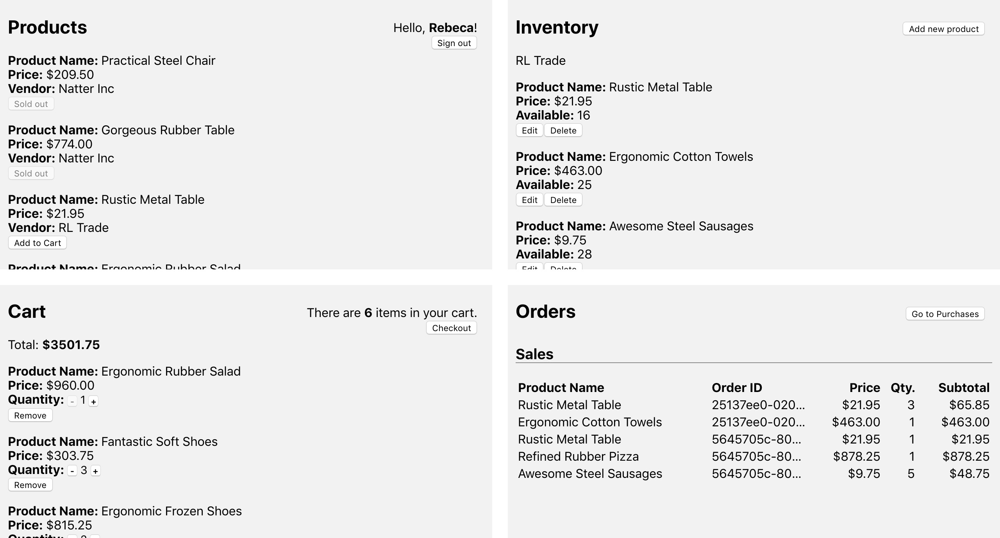

# React Redux Cart 
This projects builds on Redux's **Shopping Cart Example.** https://github.com/reduxjs/redux/tree/master/examples/shopping-cart. It uses a normalized data keeping the data flat. It also uses the selector pattern for computing derived data. 

## Screenshot and Demo
[https://pop-cart.herokuapp.com/](https://pop-cart.herokuapp.com)


## A sample user data:
A user may be a vendor, a buyer, or both. Each user has both vendor and buyer data. 

```javascript
"bbeec34e-d71a-4128-8502-5bfef4776b9f": {
  "userId": "bbeec34e-d71a-4128-8502-5bfef4776b9f",
	"firstName": "Rebeca",
	"lastName": "Luettgen",
	"email": "rebecaluettgen@yahoo.com",
	
	// buyer data
	"buyerOrderIds": ["09553d5e-93f4-46d9-8a59-88d1c3268fdf"],
	"cartProductIds": [
		"08e01ab1-3226-4e9d-88c8-80527338becc",
		"3e59a0db-1115-4d0a-8018-b1816af37afd"
	],
	"cartProductQuantityById": {
		"08e01ab1-3226-4e9d-88c8-80527338becc": 2,
		"3e59a0db-1115-4d0a-8018-b1816af37afd": 3
	},
	
	// vendor data
	"vendorName": "RL Trade",
	"vendorOrderIds": [
		"25137ee0-020a-4237-aecd-8f6480a5288c",
		"5645705c-806e-4d55-83a4-975f2e35b030"
	],
	"inventoryProductIds": [
		"2627095e-31c3-4099-9a89-f0cedcabd989",
		"81c4752c-583b-421d-8ea4-69e2fca24e44",
		"22ff52c9-ee39-4736-b6b8-9efa42a7429b",
		"d5cc48a9-d755-4e95-a069-c067b80511ba",
		"eeca05d2-84b0-4d4a-8d00-c50a15cb320a",
		"2bead201-3b9e-4772-a3b9-789658cc98b9",
		"db8bf420-7c17-48f9-a4b4-fdbf9f2589c1",
		"4224d21d-d508-40f4-bd79-9daf1131f9ff"
	]
},
```
